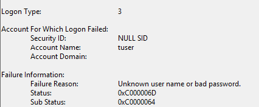
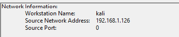

# Failed Authentication Incident (Event ID 4625)

## Summary

A failed Remote Desktop authentication attempt was generated from a Kali Linux attacker system against a Windows Server 2019 target during blue team lab testing.

## Attack Simulation

The attack originated from a Kali Linux VM using xfreerdp with invalid credentials against the Windows server's RDP service.

## Evidenve

- Event ID: 4625
- Authentication Type: Remote Desktop / Network Logon
- Target Account: testuser
- Source System: Kali Linux VM
- Failure Reason: Invalid credentials

## Investigation

Windows Security logs were reviewed in Event Viewer to identify the failed RDP authentication attempt. Relevant log fields including account name, source IP address, and logon type were analyzed to confirm the origin and nature of the activity.

## Screenshots

**Event log:**

**Event Source:**

## Assesment 

The activity simulated password spraying or unauthorized authentication attempts against a Windows system. In a production environment, repeated events of this type would warrant investigation for possible brute-force activity.

