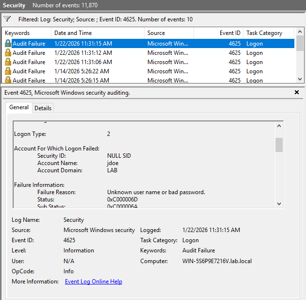
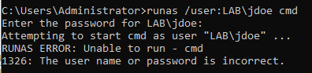

# Failed Authentication Incident (Event ID 4625)

## Summary
Multiple failed authentication attempts were observed against a domain user
account during lab testing.

## Account Targeted
- Username: jdoe
- Domain: lab.local

## Evidence
- Event ID: 4625
- Logon Type: 2
- Failure Reason: Bad password

## Assessment
Single-source failed authentication activity. No successful logon observed.
Activity would be monitored for escalation in a production environment.

## Evidence Screenshots

**Failed authentication event (Event ID 4625):**

 

**Failed logon attempt via runas:**

