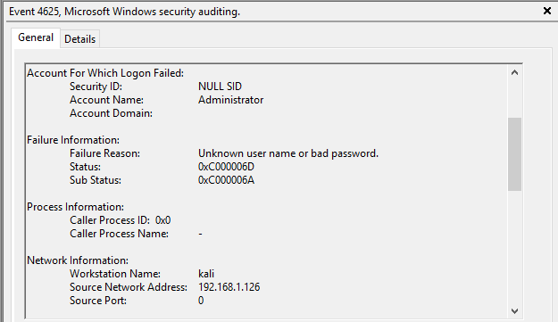

# Initial Access

## Objective

Attempt authentication against exposed services.

## Attacker Activity:

The attacker attempted to gain an RDP session through an administrative account using variations of known weak credentials. After several attemps one of the combinations was successful.

## Defender Findings:

- Event ID 4625 entries were identified in the Security log, indicating failed authentication attempts from the Kali Linux attacker system. The logs captured unsuccessful login activity targeting the Domain Controller and provided evidence of attempted remote access through RDP. Monitoring these events enables defenders to detect potential brute-force attacks, invalid credential usage, and unauthorized access attempts.

