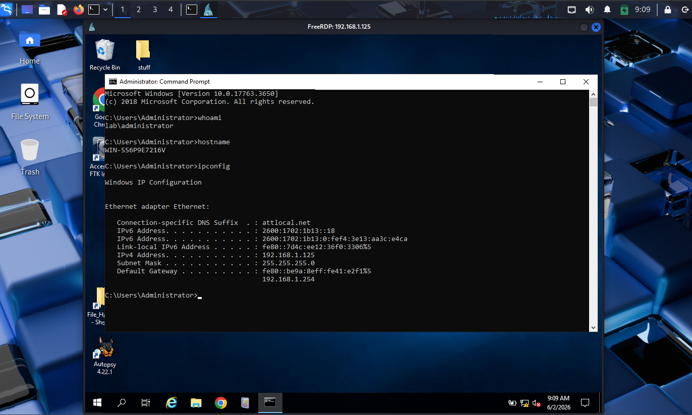
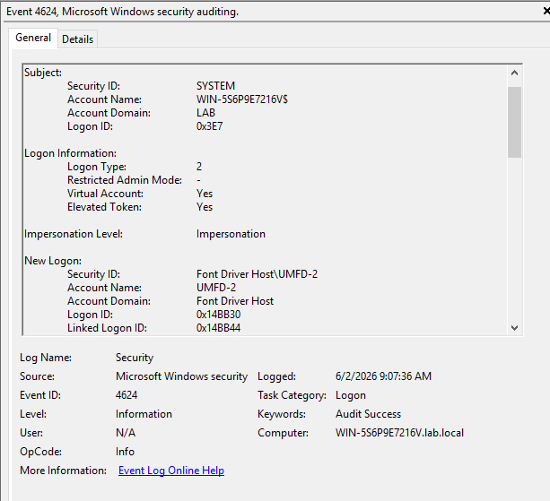

# Execution

## Objective

Use vulnerable serives found during reconnaissance to exploit to the system and gain access.

## Attacker Activity:

After obtaining access to the target system, basic host enumeration was performed to identify the compromised machine and current user context. Commands such as hostname and whoami were used to determine the system name and active user account.

## Defender Findings:

While there were no logs pointing directly to an attack happeneing. There is evidence to suggest an unusual successful login took place just after 9am when the affected user should have been offline. This could suggest that the account is compromised but futher investigation is needed.

