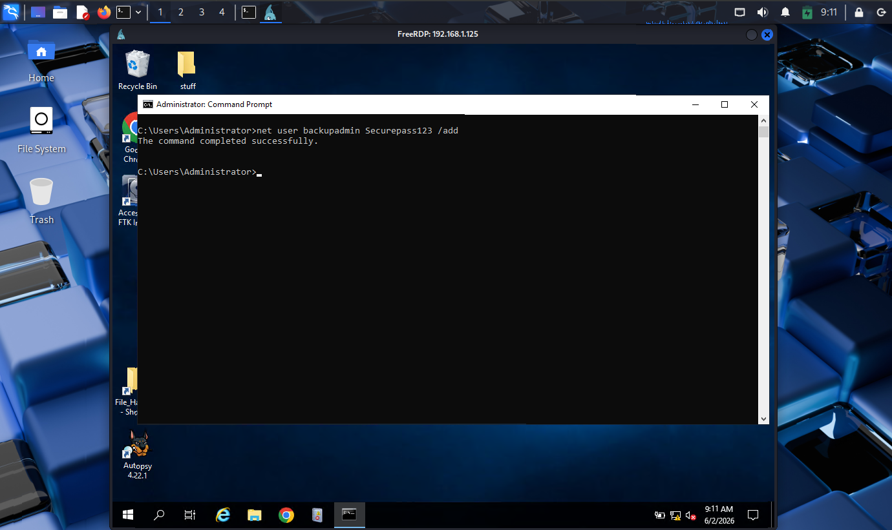
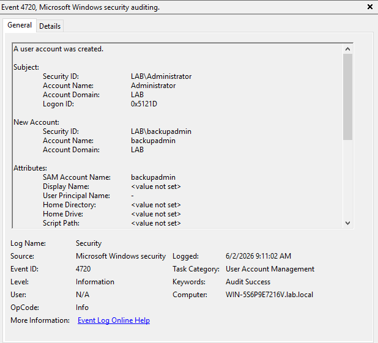

# Persistence

## Objective

Maintain access to the compromised system.

## Attacker Activity:

Once access is gained the attacker needed a way to persist on the system. This was done through an added administrative account.

## Defender Findings:

Windows Security Event Viewer recorded the creation of a new user account. This activity is significant because new account creation can be used to establish persistence or expand access on the system.

