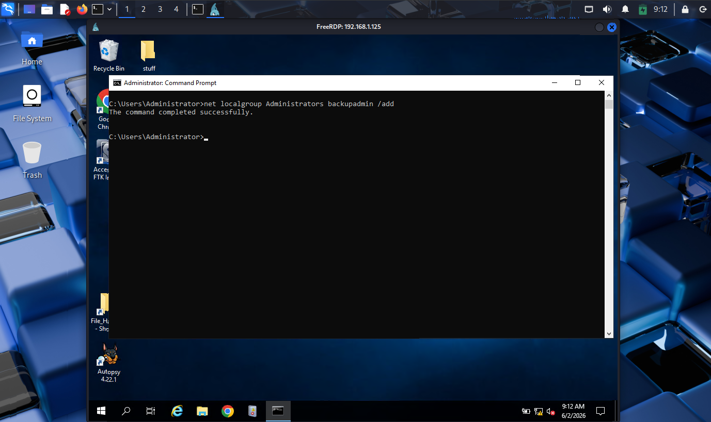

# Privilege escalation

## Objective

Expand access on the compromised system.

## Attacker Activity:

The attacker used the localgroup command to add themselves to the administrator group.

Defender Findings:

There were no logs indicating the newly created account escalated is permissions, but with the user being called "backupadmin" context will tell us to assume they were. 
