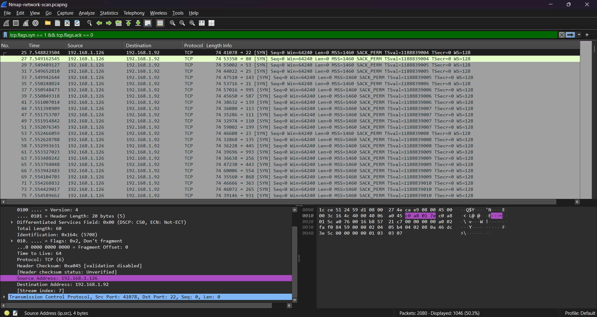
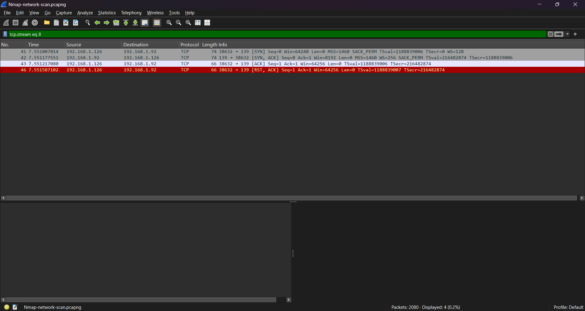
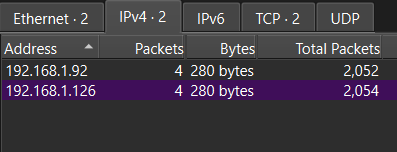

# Detection and Analysis

The investigation began after suspicious network activity was identified during routine packet capture analysis in Wireshark. Initial observations revealed a large volume of TCP connection attempts originating from a single internal host and targeting numerous TCP ports on a Windows 11 workstation over a short period of time.

To isolate the activity, Wireshark display filters were applied to identify TCP connection attempts and analyze the communication between the source and destination hosts. Analysis showed that a single source IP address initiated connection attempts against hundreds of destination ports, a behavior commonly associated with network reconnaissance and port scanning.

Further examination of the packet capture identified the traffic as a TCP Connect scan (`nmap -sT`). Unlike a SYN scan, the observed traffic completed the TCP three-way handshake before terminating the connection, producing a series of SYN, SYN/ACK, ACK, and RST packets across multiple destination ports. This behavior matched the expected characteristics of an Nmap TCP Connect scan.

The packet capture also identified the source system as the Kali Linux host and the destination as the Windows 11 workstation. Connection attempts were observed against a wide range of TCP ports within a very short timeframe, indicating an automated reconnaissance process rather than normal user activity.

To determine whether the activity was observable through endpoint telemetry, Sysmon logs were reviewed and correlated within Splunk. No corresponding Sysmon Event ID 3 records were identified for the inbound scan traffic. This result was expected because the Sysmon deployment was limited to the target Windows system, where Event ID 3 primarily records network connections initiated by the local host. Consequently, the packet capture served as the primary source of evidence for reconstructing the events of the investigation.

## Filtered Wireshark capture

## A full TCP conversation

## Wireshark statistics

