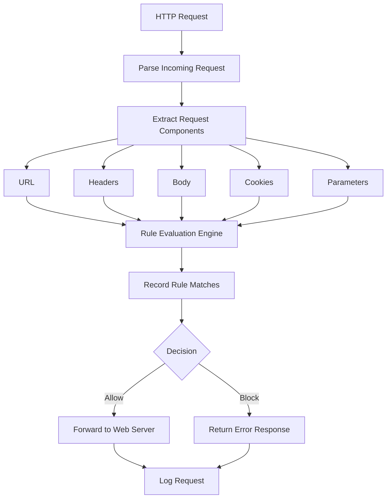

# Overview
The goal of this project is to create a Web Application Firewall (WAF) using Python that sits between the client and the web server. Every incoming HTTP request is intercepted and analyzed before it reaches the application. The firewall inspects request components such as the URL, headers, body, cookies, and query parameters, then evaluates the request against a collection of security rules. Based on the results, the request is either allowed or blocked, and all activity is logged for analysis and auditing.

## High level workflow diagram:

 
