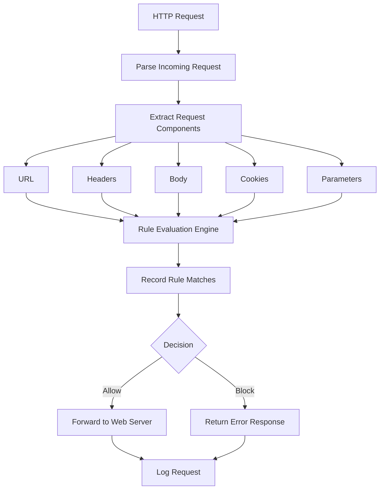

# Python WAF (Web Application Firewall)

A lightweight, rule-based Web Application Firewall (WAF) built in Python using Flask.  
This project demonstrates how HTTP requests can be intercepted, analyzed, and blocked using custom security rules.


## Overview
The goal of this project is to create a Web Application Firewall (WAF) using Python that sits between the client and the web server. Every incoming HTTP request is intercepted and analyzed before it reaches the application. The firewall inspects request components such as the URL, headers, body, cookies, and query parameters, then evaluates the request against a collection of security rules. Based on the results, the request is either allowed or blocked, and all activity is logged for analysis and auditing.


## Features

- Reverse proxy request handling using Flask
- Inspection of:
  - URL path
  - Query parameters
  - HTTP headers (Host, User-Agent)
  - Request body
- Regex-based detection engine
- Rule-based blocking system
- Attack logging system with structured output
- Support for multiple attack types:
  - SQL Injection
  - Cross-Site Scripting (XSS)
  - Command Injection
  - Path Traversal


## High level workflow diagram:


 
## How to run
1. Install dependencies
```bash
pip install flask requests
```

2. Start your backend server
   - Run your backend application (example: Flask app on port 5000)

3. Start WAF proxy
```bash
python app/proxy.py
```
**WAF runs on:**
```bash
http://127.0.0.1:8080
```

# Limitations
This is an educational project and not intended for production use.

**Current limitations:**

- Regex-based detection only (no ML/behavioral analysis)
- No rate limiting or DDoS protection
- No TLS/HTTPS handling
- No advanced evasion detection (encoding, obfuscation bypasses not fully covered)

## Future Improvements
- JSON-based rule configuration
- Web dashboard for monitoring attacks
- Rate limiting / IP throttling
- Persistent database logging (SQLite/PostgreSQL)
- Advanced payload decoding (URL encoding, double encoding)
- Integration with SIEM tools

## Author Notes
This project was built to explore how Web Application Firewalls work internally by implementing:

- request interception
- pattern-based detection
- logging and classification of attacks

It serves as a foundational cybersecurity project for understanding web attack vectors and defensive programming.
