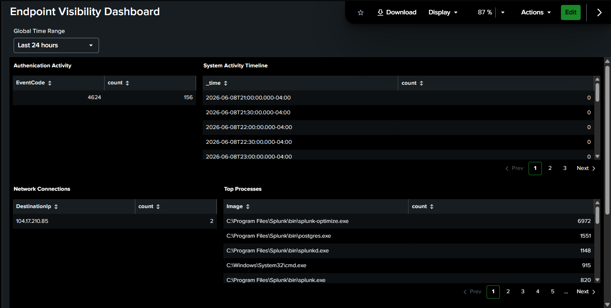
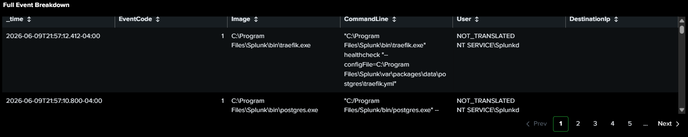

# Overview:
This project was made to demonstrate how to build an endppoint monitoring dashboard using Splunk and Sysmon. The goal was to transform raw Windows event logs into meaningful security visibility.

## Environment:
- Windows 11 (Host machine)
- Sysmon (endpoint telemetry)
- Splunk Enterprise
- Local lab environment

## Data Sources:
**Sysmon**

Provides endpoint visibility including:
- Process creation
- Network connections
- File and registry activity

**Windows Security Logs**

Provides authenication visibility:
- Successful logins
- Failed logins

## Dashboard Design Philosophy:
The dashboard was desgined to reflect a SOC analyst workflow:
1. Authentication monitoring
2. Endpoint process visibility
3. Network activity tracking
4. Investigative drill-down

Each panel was made to represent a different layer of endpoint security.

## Dashboard Panels & Queries:
**Authentication Activity:**

index=endpoint (EventCode=4624 OR EventCode=4625)                                                                                                                   
| stats count by EventCode

**Why this?** It detects success/failure patterns and brute force attempts.

---

**Top Processes:**

index=endpoint EventCode=1                                                                                                                                              
| stats count by Image                                                                                                                                                  
| sort -count

**Why this?** It identifies executed processes and potential malicious binaries.

---

**Network Connections:**

index=endpoint EventCode=3                                                                                                                                                  
| stats count by DestinationIp                                                                                                                                            
| sort -count

**Why this?** It can show outboud connections and potential suspicious traffic.

---

**System Activity Timeline:**

index=endpoint                                                                                                                                                            
| timechart count

**Why this?** It highlights spikes in system behavior over time. 

---

**Event Detail View:**

index=endpoint                                                                                                                                                       
| table _time EventCode Image CommandLine User DestinationIp

**Why this?** This provides a raw investigative context for analysis.

---

## Screenshots:
**Dashboard Overview**

## Key Takeaways:
**High-Fidelity Endpoint Visibility with Sysmon**

Sysmon significantly expands Windows logging capabilities by recording detailed endpoint activity that is not available through standard Windows Event Logs alone. Events such as process creation, network connections, PowerShell execution, and parent-child process relationships provide defenders with valuable context when investigating suspicious activity. This level of visibility allows analysts to move beyond simple alerts and understand exactly what occurred on a system.

**Splunk Enables Correlation Across Multiple Data Sources**

One of Splunk's greatest strengths is its ability to correlate related events from different log sources. By combining Sysmon process creation events with network connection data, analysts can identify potentially malicious behavior that would be difficult to detect from a single event type. This correlation helps transform isolated log entries into a complete attack narrative.

**Dashboard Design Reflects Real SOC Operations**

The dashboard was intentionally designed to mimic how SOC analysts monitor environments. Instead of displaying raw logs, visualizations were organized to highlight key security metrics such as process activity, network connections, and high-volume event trends. This approach allows analysts to quickly identify anomalies and prioritize investigations more efficiently.

**Effective Detection Requires Analysis, Not Just Alerts**

While alerts can indicate suspicious activity, they often lack sufficient context for decision-making. The true value of security monitoring comes from analyzing the underlying telemetry to understand what happened, when it occurred, and whether it represents malicious behavior. This project demonstrates how dashboards and log analysis can reduce noise while improving investigative capabilities.

## Conculsion:
This project demonstrates how raw endpoint telemetry collected through Sysmon can be transformed into meaningful security intelligence using Splunk. By ingesting, parsing, and visualizing endpoint data, the dashboard provides analysts with actionable insights into system activity and potential security threats.

The project also highlights core blue team concepts including log collection, data correlation, security monitoring, and threat detection. Rather than relying solely on automated alerts, analysts can leverage dashboard-driven investigations to identify suspicious behavior and build a deeper understanding of events occurring within their environment.

Overall, this lab serves as a practical introduction to Security Operations Center workflows and showcases how modern security teams use endpoint telemetry and SIEM platforms to improve visibility, accelerate investigations, and support effective incident response.
